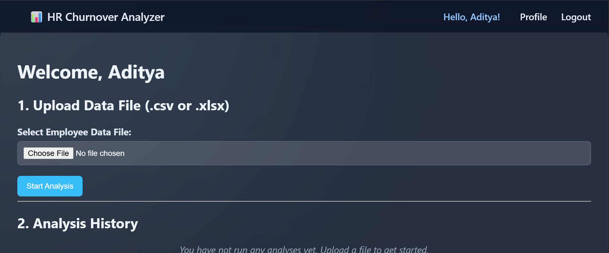
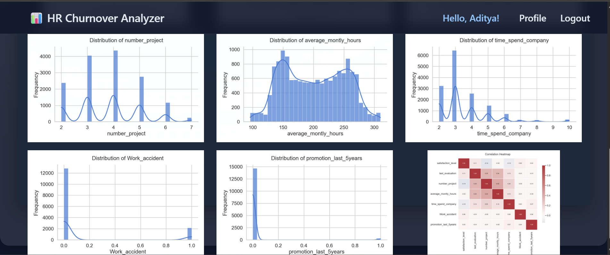

HR Employee Turnover Analyzer
#Project Overview

The HR Employee Turnover Analyzer is a machine learning–based web application developed to predict employee attrition within an organization.

This system analyzes employee data and identifies patterns that may indicate whether an employee is likely to leave the company. The project integrates Machine Learning models with a Django web application to provide predictions and visual insights.

This tool can help HR departments make data-driven decisions to reduce employee turnover.

#Key Features
*Predict employee turnover using machine learning models
*Dashboard to visualize employee data
*Cost analysis related to employee turnover
*Efficiency analysis of employee performance
*User login and registration system
*Data visualization for better insights

#Technologies Used
*Backend
 Python
 Django

*Machine Learning
 Scikit-learn
 Pandas
 NumPy

*Visualization
 Matplotlib
 Seaborn

*Frontend
 HTML
 CSS
 Django Templates

*Database
 SQLite

#Machine Learning Models

The project uses multiple machine learning models to predict employee turnover:
 Logistic Regression
 Random Forest Classifier
 gradient boost

*Machine Learning Workflow
1.Data preprocessing
2.Handling missing values
3.Feature scaling
4.Training machine learning models
5.Model evaluation
6.Employee turnover prediction
The trained models are stored as .pkl files and loaded into the Django application.

#Model Performance
The project uses an AutoML-based approach to evaluate multiple machine learning algorithms for predicting employee turnover.
Three classification models were trained and compared to determine the best performing model.

*Models Evaluated
Logistic Regression
Random Forest Classifier
Histogram Gradient Boosting

Tree-based ensemble models demonstrated superior performance compared to the baseline Logistic Regression model, as they are better at capturing non-linear relationships between employee satisfaction, workload, and attrition patterns.

*Best Performing Model
The automatically selected Production Model (typically Random Forest) achieved the following performance metrics:

*Metric	Score
Accuracy	> 90%
Precision	> 0.95
Recall	> 0.90

These results indicate that the model performs reliably in identifying employees who are at risk of leaving the organization.

#Dataset
The dataset contains employee information used to predict turnover.
Example features include:
- Age
- Department
- Salary
- Job Role
- Years at Company
- Job Satisfaction
- Work-Life Balance

Target Variable:
- Turnover (Yes / No)

#Project Structure
turnover_project
│
├── turnover_app
│   ├── models.py
│   ├── turnover_model.py
│   ├── cost_module.py
│   ├── efficiency_module.py
│   └── views.py
│
├── templates
│   ├── home.html
│   ├── dashboard.html
│   ├── login.html
│   ├── register.html
│
├── static
│   └── css / images / js
│
├── visualizations
│
├── manage.py
├── db.sqlite3
│
├── turnover_analysis_log_reg_turnover_model.pkl
├── turnover_analysis_scaler_X.pkl
├── turnover_analysis_imputer.pkl
│
└── README.md

#Installation Guide
1. Clone the repository
git clone https://github.com/PankajPatole-AI/Hr_Turnover_Analyzer.git
2. Navigate to the project directory
cd turnover_project
3. Install required dependencies
pip install -r requirements.txt
4. Apply database migrations
python manage.py migrate
5. Run the Django server
python manage.py runserver
6. Open the project in browser
http://127.0.0.1:8000/

#Future Improvements
 Deploy the project on cloud platforms (AWS / Render / Heroku)
 Add deep learning models for better prediction
 Improve dashboard analytics
 Enhance user interface and user experience

#Project Screenshots

*Home Page

*Dashboard

*Prediction Result

Author
Pankaj Patole
AI & Data Science Enthusiast
Interested in Machine Learning, Data Science, and AI Engineering.

